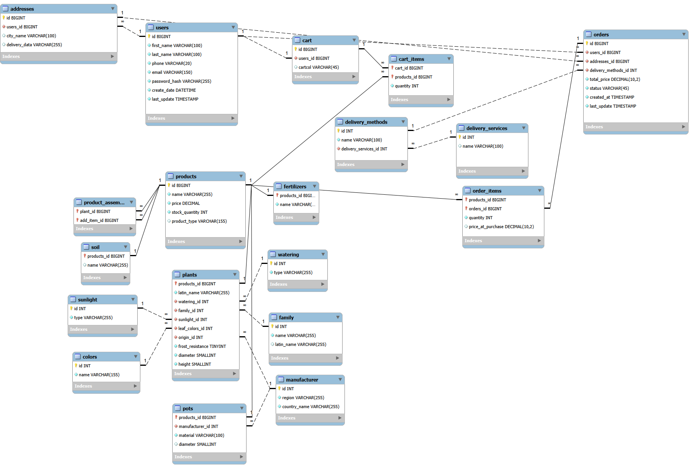
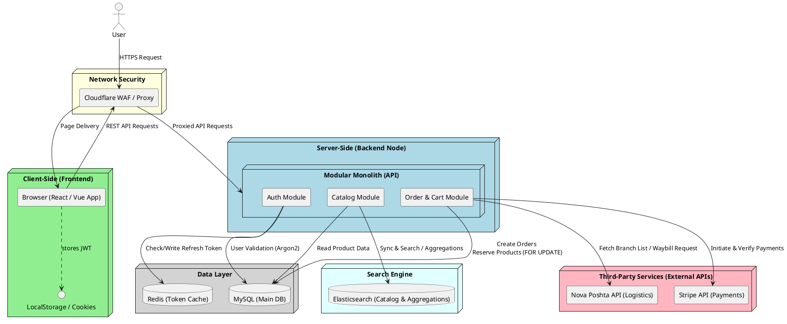
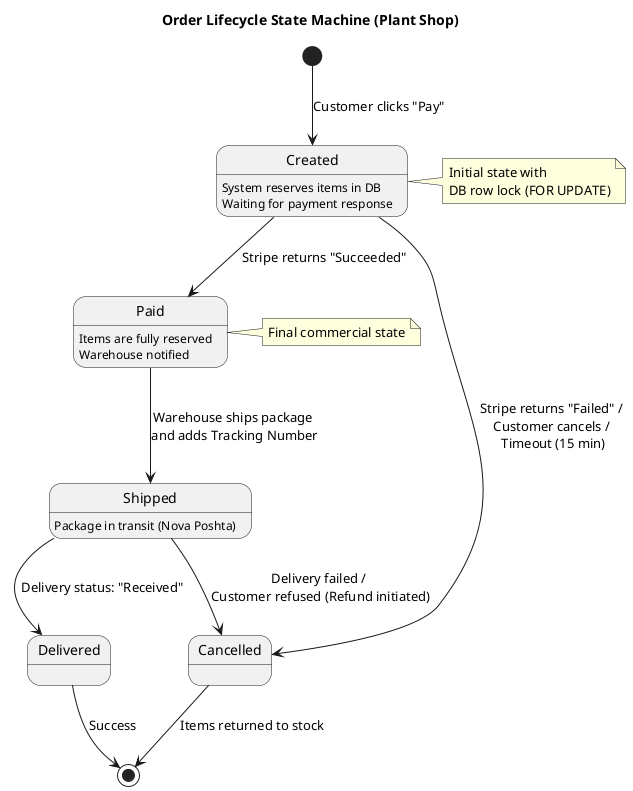
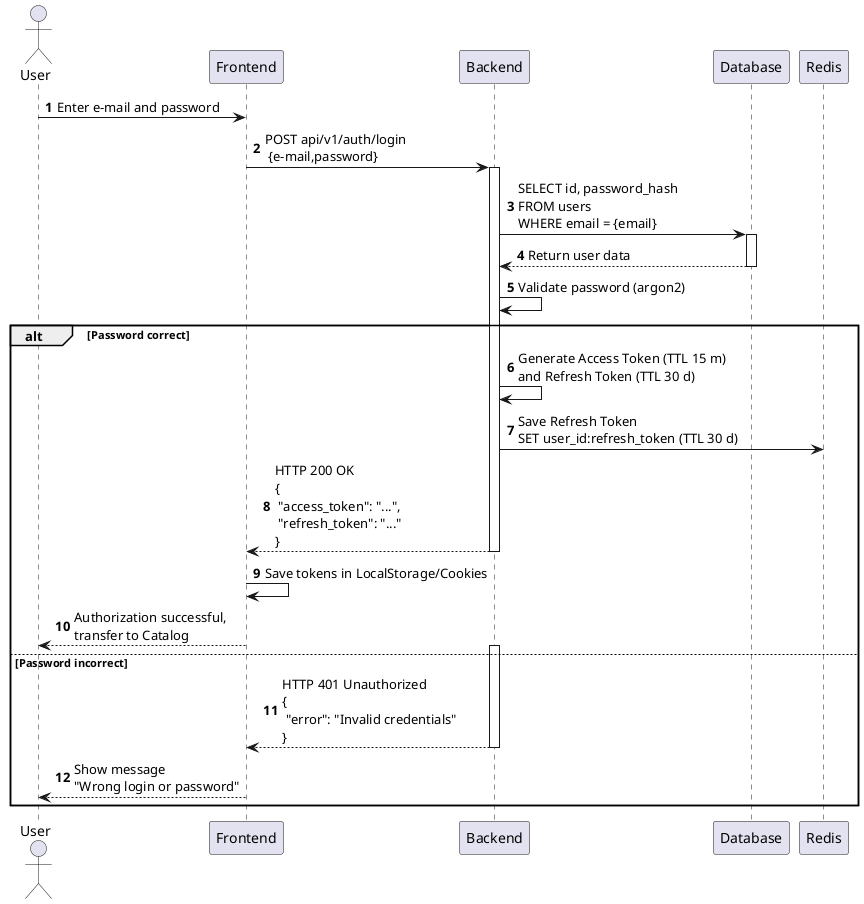
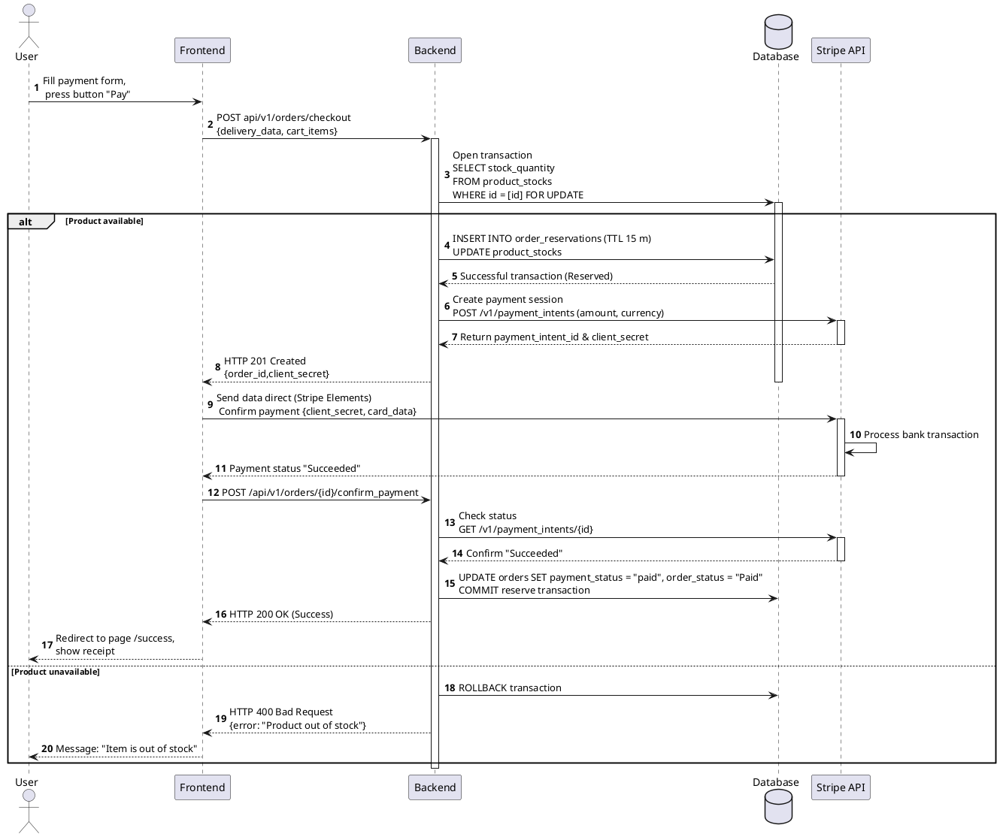

# Green Shop: Full Technical Project Specification

## Table of Contents
* [Section 1: Business Analysis and Strategy](#section-1-business-analysis-and-strategy)
* [1. Product Vision & Scope](#1-product-vision--scope)
* [2. User Personas](#2-user-personas)
* [3. User Stories](#3-user-stories)
* [4. Business Goals & Requirements](#4-business-goals--requirements)
* [5. Assumptions & Constraints](#5-assumptions--constraints)
* [Section 2: System Analysis and Design](#section-2-system-analysis-and-design)
* [1. Architectural Routing and Interface Structure (UI/UX Scope)](#1-architectural-routing-and-interface-structure-uiux-scope)
* [2. Module: Catalog & Product Filtering (Functional Requirements & Use Cases)](#2-module-catalog--product-filtering-functional-requirements--use-cases)
* [3. Use Cases](#3-use-cases)
* [4. Non-Functional Requirements (NFR)](#4-non-functional-requirements--nfr)
* [5. Data Model (ERD) & Database Architecture](#5-data-model-erd--database-architecture)
* [6. Technical Interactions](#6-technical-interactions)
* [7. API Documentation & Mock Server (Postman)](#7-api-documentation--mock-server-postman)

---

## Section 1: Business Analysis and Strategy

### 1. Product Vision & Scope

#### 1.1. Business Background
Many potential customers hesitate to purchase houseplants due to a **lack of clear and transparent information regarding the care requirements** for each specific species. Users fear "losing" a plant due to improper watering or lighting levels.

Furthermore, buying a plant often creates extra hassle, such as the need to separately find the right soil, a pot of the correct size for future growth, and suitable fertilizers.

#### 1.2. Product Value Proposition
The platform offers customers not just an individual product, but a **comprehensive ecosystem solution** that saves the buyer's time, money, and effort:
1. **Intuitive Selection:** The ability to choose a plant based on specific criteria (filters) that fit the user's comfort level, which eliminates the fear of making a mistake.
2. **Kit Builder (Cross-sell):** Customers can customize their purchase in one click. Instead of a standard shipping pot, they can choose a permanent one (selecting the color, material, and a larger size "for growth"), along with automatically selected fertilizers for that specific plant type.
3. **"Ready-to-Go Solution" Service:** An optional service for professional plant repotting before shipping. This allows the buyer to get a plant that is completely ready for their interior, without the need to do messy work at home.

---

### 2. User Personas

#### 2.1. Persona 1: Beginner User (Alex)
* **Profile:** Wants to add some greenery to his home but has no experience in plant care. He is exhausted by the conflicting information on the internet and confusing classifications (for example, when a regular Monstera has many different subspecies).
* **Context & Pain Points:**
  * Fears wasting money and time if the plant dies.
  * Does not understand watering schedules (which plants need daily watering and which need it once a week).
  * Cannot evaluate the microclimate in his apartment on his own: hesitates where to put the pot — in a sunny kitchen or a darker room with an air conditioner and blinds.
* **Product Solution (How the system solves the pain points):**
  * **Specialized Filters:** Allow Alex to choose a plant based on his apartment parameters (`Lighting`, `Watering`), so he only needs to focus on the price.
  * **Online Consultation:** The option to get professional help and a personal recommendation from an expert directly on the platform.
  * **Automatic Supplies Matching:** Related products (pot, soil, fertilizers) and the repotting service are already perfectly matched to the chosen plant, which eliminates the risk of making a mistake during care.
#### 2.2. Persona 2: Expert Collector (Elena)
* **Profile:** Has been into home gardening for over 5 years and collects a specific genus of plants (for example, Monsteras).
* **Context & Pain Points:**
  * **Name Confusion:** Due to the lack of unified standards in shops, she risks accidentally buying a Monstera subspecies she already owns.
  * **Supplies Logistics Issues:** When ordering from different marketplaces, pots and the right substrate are often delayed or arrive at different times, which disrupts the repotting schedule.
  * **Aesthetic Discomfort:** Wants to display her collection to other gardeners, but standard plastic pots ruin the room's interior.
* **Product Solution (How the system solves the pain points):**
  * **Global Standardization (Latin Search):** Having botanical Latin names on product cards and the ability to search by them allows Elena to precisely identify rare subspecies without the risk of duplication.
  * **All-in-One Delivery:** Completely eliminates delay issues, as the plant, a designer pot customized by color/material, and the required soil all arrive in a single order.

---

### 3. User Stories
* **US-01 (Catalog & Beginner):** As a beginner buyer, I want to have filters based on care criteria (e.g., lighting, watering frequency) so that I can confidently choose plants for my conditions and not worry about them dying.
* **US-02 (Bundling & Pro):** As an experienced user, I want to be able to buy products as a bundle (plant, fertilizers, soil, compatible pot, and repotting service) to get a customized, comprehensive solution in a single order.
* **US-03 (Authorization):** As a registered user, I want the system to keep me logged in (session) so that I don't have to re-enter my login and password every time I visit the website.
---

### 4. Business Goals & Requirements

#### 4.1. Business Goals (Business Goals / KPIs)
* **BG-1 (Time-to-Market):** Launch online sales (platform MVP) within **2 months** from the start of active development for a quick market entry and business model testing.
* **BG-2 (AOV Growth):** Increase the Average Order Value (*AOV*) by implementing cross-sell mechanisms for related products and additional services.

#### 4.2. Business Requirements (Business Requirements – BR)
* **BR-01 (Online Payments):** The system must enable real-time online order payments through integration with an external payment gateway (e.g., LiqPay, Monobank API, or Fondy).
* **BR-02 (Smart Bundling Logic):** Implement business logic for comprehensive order assembly in the system. The platform must automatically recommend and allow flexible selection of pots, fertilizers, and repotting services that are technically compatible and fit the parameters of the specific chosen plant.

---

### 5. Assumptions & Constraints

#### 5.1. Scope & Logistics
* **Going Online:** The business scales from a local physical network in a single city to a nationwide online store.
* **Delivery:** Sales are carried out across the entire country. Logistics are implemented through integration with external postal services and delivery companies (e.g., Nova Poshta).

#### 5.2. Product Boundaries
* **MVP Specification:** At the initial launch stage, the catalog contains exclusively houseplants (indoor plants), as well as related companion products (designer pots, specialized fertilizers, substrates) and services (professional planting/repotting).
* **Out of Scope:** Garden crops, open soil, outdoor trees, shrubs, and seeds for the agricultural sector are not supported in the MVP phase.

#### 5.3. Localization
* **Language Versions:** The system must support two language localizations – Ukrainian (UA) and English (EN).
* **Justification:** Despite the focus on the domestic market, the business includes English to serve expats, tourists, and foreigners living in the country who do not speak the state language.
* **Nomenclature:** Regardless of the selected interface language, the international botanical Latin name of the plant must be displayed on the product card and remain searchable.

#### 5.4. Architectural Assumptions
* **MVP Strategy:** To ensure rapid time-to-market, minimize development time, and reduce infrastructure costs, a modular monolithic architecture is adopted for the MVP launch phase.
* **Scaling Perspective:** The backend application must be strictly separated into isolated logical modules (Catalog, Cart, Users). This is necessary so that during future load growth, these blocks can be seamlessly migrated into separate microservices without completely rewriting the system code.

#### 5.5. Business Process Modeling (BPMN Diagram)
This diagram describes the order lifecycle: from the moment a buyer's need arises to the final delivery of the product.

The notation is structured using three independent pools:
* **User Pool (Customer):** Reflects customer autonomy. It is initiated by the "Need for Purchase" event and the "Opening Website" process, which sends a signal (*Message Flow*) to the store system.
* **Online Store Pool (Store Platform):** Divided into two lanes (*Website* and *Warehouse*), allowing clear separation between digital operations (frontend/backend) and physical warehouse processes.
* **Delivery Service Pool (Logistics Partner):** Represented as a "Black Box", emphasizing the integration nature of the interaction with the external system solely through messages.

---

## Section 2: System Analysis and Design
### 1. Architectural Routing and Interface Structure (UI/UX Scope)
The system implements a modular monolithic structure where the frontend interacts with the backend through a single domain. The application must include the following mandatory user interfaces (pages/screens) and their corresponding URL routes:

* **Product Catalog (`/catalog`):** The main page and initial screen for the buyer. Provides the ability to view and select plants. Root URL of the site by default.
* **Product Page (`/products/{id}`):** Detailed card of a specific plant or related product, where `{id}` is the unique identifier of the item in the database.
* **Cart (`/cart`):** Interface for viewing selected products, managing their quantities, and configuring dependent services/accessories.
* **Checkout (`/checkout`):** Form for entering buyer data, selecting delivery methods across the country, and integrating with the payment gateway.
* **Registration (`/register`) and Authentication (`/login`):** Screens for account creation and login.

#### 1.1. Catalog Page Prototype (Figma UI/UX)
* **[Interactive Prototype](https://figma.com)**

The elements on the "Catalog" page interface are designed taking into account the needs of both types of target audiences (beginners and experienced plant growers):

* **Header:**
  * *Branding:* Logo and store name.
  * *Search Bar:* Implemented for quick access to products by name.
  * *Functional Icons:* Consultation request (quick contact with a specialist), Profile (access to the personal account), and Cart (visual indicator of added products).
  * *Localization:* Language switcher (UA/EN) to support system accessibility requirements for foreign users.
* **Main Content:**
  * *Navigation:* Clear page title and breadcrumbs (`Breadcrumbs`) ensuring the user understands their current position.
  * *Filter Panel:* A system of detailed filters by care parameters (*lighting, watering, complexity*). This allows getting an expert selection of products.
  * *Product Grid:* Products are presented as cards. Sorting by price and alphabet is implemented.
  * *Pagination (Load More):* Using a 'Load More' button instead of classic pagination ensures a seamless user experience and smooth browsing of the assortment.
* **Footer:**
  * Standard block with links to social media, help sections, privacy policy, and copyright.
---

### 2. Module: Catalog & Product Filtering (Catalog & Filtering)

#### 2.1. Functional Requirements

##### FR-01: Displaying Out-of-Stock Products
* **Description:** If products exist for the selected combination of filters but their stock quantity equals zero, the system must display these cards in the general grid and visually label them.
* **Acceptance Criteria:**
  * **Given:** The user has selected filters (including the case where the number of selected filters = 0).
  * **When:** These products are out of stock (`stock_quantity = 0`).
  * **Then:** The system must display the cards with a "Out of stock" text label overlaid on the image.
  * **And:** The `+ Cart` button becomes inactive (`disabled`), and its text changes to "Notify when available".

##### FR-02: Handling Empty Filter Results
* **Description:** If the filter combination selected by the user yields zero results in the database (product count = 0), the system must hide the product grid and display an informational message with an analytical tooltip.
* **Acceptance Criteria:**
  * The number of displayed product cards equals 0.
  * In the center of the catalog (instead of the product grid and the `LOAD MORE` button), the message "Product not found" is displayed.
  * Under the "Product not found" message, an analytical tooltip is shown indicating the number of available products for each selected filter individually. Display format: *[Filter Name] – [Number of products in DB]* (e.g., *Palms – 12 pcs., Purple – 2 pcs., Large – 46 pcs.*).

##### FR-03: Dynamic Loading Logic (Infinite Scroll & Load More)
* **Description:** The system must automatically load products as the user scrolls down the page up to a limit of 24 items, after which it requires action confirmation via a button for further delivery.
* **Acceptance Criteria:**
  * **Initial State:** Upon the first load, the catalog displays 8 product cards.
  * **Virtual Scroll Mechanics:** When scrolling down, new cards are appended to the end of the list. Cards that are completely hidden behind the page header must be removed from memory (*Virtual Scroll*) to optimize browser performance.
  * **Automation Limit:** Automatic loading operates until a limit of 24 displayed cards is reached.
  * **Load More Button:** After the 24th card is loaded, the system displays a "Load More" button below the product grid. Further loading (25th+ product) without clicking the button is restricted.
* **API Request:** Clicking "Load More" triggers a `GET v1/products?limit=24&offset=n` request, where `limit` is the batch size (24) and `offset` (n) is the database offset, which increases by 24 with each subsequent request.
* **Final State:** If the request returns an empty list (all products have been viewed):
  * The "Load More" button transitions to the `Disabled` state (greyed out, inactive for clicks).
  * An informational tooltip appears below the button: "All products have been viewed".

---

### 3. Use Cases

#### Use Case: Cart
* **Name:** Adding a bundle of products and services to the cart.
* **Actors:** User (registered or guest), Store System.
* **Preconditions:** The user is on the product page (plant).
* **Main Course (Basic Flow):**
  * The user selects additional products (fertilizers and a pot) from the accessories carousel on the plant page.
  * The user checks the box next to the "Repotting" service.
  * The system dynamically recalculates the total price of the bundle near the "Add to Cart" button (Sum: plant + custom pot + fertilizers + repotting service).
  * The user clicks the "Add to Cart" button.
  * The system sends an asynchronous request to the backend, where it verifies the current stock availability for all selected items (`stock_quantity > 0`). The items are successfully added to the user's cart in the database (or in LocalStorage for a guest) without reserving (holding) the items in the warehouse.
  * The system increments the item counter on the cart icon in the Header by +n (where n is the number of added items, in this case +4).
  * When interacting with the "Cart" icon (click), the system displays a dropdown menu where the products are shown in a tree structure: the Plant is the main (parent) item, while the pot, fertilizers, and repotting service are subordinate (child) items.
* **Alternative Course 1 (Race Condition at the warehouse):**
  * If at the moment of clicking the "Add to Cart" button, it turns out that the main product (the plant) or a critical accessory is already out of stock (`stock_quantity = 0` due to a parallel purchase by another user):
    * The system blocks adding the bundle to the cart.
    * The "Add to Cart" button for this product transitions to the Disabled state and changes to "Notify when available".
    * An informational notification is displayed to the user: "Sorry, this item just sold out".
* **Alternative Course 2 (Repotting without a custom pot):**
  * If the user checked the box for the "Repotting" service but left the standard shipping pot in the bundle:
    * The system blocks the activation of the "Add to Cart" button.
    * A warning is displayed in red next to the repotting service: "Please choose a custom pot for repotting".
#### Use Case: Sessions
* **Name:** Extending the user session with the store.
* **Actors:** User, System.
* **Preconditions:** The user has successfully authenticated via website credentials (JWT) or a third-party service (OAuth 2), meaning they have received an `access token` (with a 15-minute TTL) and a `refresh token` (with a 30-day TTL).
* **Main Course:**
  * The user opens the website page after a certain period of time (for example, a day later).
  * An HTTP request is sent to the `POST /api/auth/refresh` endpoint of the Authentication Service (Auth Service).
  * The Auth Service queries the Redis database to check the TTL (Time to Live) of the refresh token under the condition: `exp >= current_time`, where `exp` is the token's expiration time and `current_time` is the current server time. If the condition is true, the Auth Service issues a new pair of Access + Refresh tokens, and the old refresh token is deleted from Redis.
  * The user receives the new pair of tokens in their browser (seamlessly to them) and continues working with the store system without having to re-enter their login and password.
* **Alternative Path:**
  * If the condition `exp >= current_time` is not met, meaning `exp < current_time` (the refresh token has expired):
    * The Auth Service rejects the request.
    * The user is automatically redirected to the login form — the Authentication page (`/login`).

#### Use Case: Checkout
* **Name:** Placing an order for delivery.
* **Actors:** User, Store System.
* **Preconditions:** The user clicked the "Checkout" button in the cart, the system verified product availability in the warehouse (`stock_quantity > 0`), and opened the checkout screen.
* **Main Course (Basic Flow – Delivery to a Branch):**
  * The system automatically populates the input fields with data from the user profile (`users`), leaving them editable.
  * The user selects the "Nova Poshta" delivery service from the dropdown menu.
  * The user selects the delivery type: "Branch".
  * The frontend makes a `GET /api/v1/nova_post/warehouses?city={user_city}` request to our server. The system retrieves the list of branches from the local database and displays them in a dropdown.
  * The user selects the desired branch from the list.
  * The user selects a payment method and clicks the "Confirm Order" button.
* **Alternative Path:**
  * This step begins after the third step of the main course if the user selects "Courier":
    * The system hides the branch selection dropdown.
    * The system displays additional mandatory address fields: "Street", "House Number", "Apartment". The user fills in the address fields manually.
    * The user proceeds to the final step of the main course (payment method selection and confirmation).
---

### 4. Non-Functional Requirements (NFR)

#### 4.1. Performance & Speed
##### NFR-01 (Initial Load – Cold Start): Full page loading and rendering (the moment interaction becomes possible) of the first batch of products (8 cards) during the first visit must not exceed 2.0 seconds.
* **Acceptance Criteria:**
  * **Given:** The user has launched the page for the first time (the browser cache is empty).
  * **When:** The catalog page is opening.
  * **Then:** The page and the initial 8 products must fully load (the moment interaction becomes possible) in no more than 2 seconds.

##### NFR-02 (Initial Load – Warm Start): Full loading and rendering (the moment interaction becomes possible) during a repeat visit (with cache) – no more than 1.5 seconds.
* **Acceptance Criteria:**
  * **Given:** The user has launched the page not for the first time (downloaded cache is present).
  * **When:** The catalog page is opening.
  * **Then:** The page and the initial 8 products must fully load (the moment interaction becomes possible) in no more than 1.5 seconds.

##### NFR-03 (Data Retrieval Latency): The server response wait time after clicking the "Load More" button (a request for 24 new cards) and rendering (the moment interaction becomes possible) of the first new 8 cards must not exceed 1.5 seconds (standard – 1.2 seconds).
* **Acceptance Criteria:**
  * **Given:** The user has clicked the `Load More` button and sent a request to load 24 additional cards.
  * **When:** The user reaches the end of the loaded products.
  * **Then:** The new cards must be received and displayed (the moment interaction becomes possible) in no more than 1.5 seconds.

##### NFR-04 (Smooth Scrolling & Rendering): When scrolling through cards after receiving data from the server via the GET method, rendering (the moment interaction becomes possible) of each subsequent batch of cards (rendering into the DOM) must occur instantly – no more than 0.1 seconds.
* **Acceptance Criteria:**
  * **Given:** The user has loaded a new batch of 24 cards after clicking the `Load More` button and is scrolling.
  * **When:** The user passes n pixels.
  * **Then:** The rendering of the new cards (the moment interaction becomes possible) occurs instantly – no more than 0.1 seconds.

##### NFR-05 (Concurrent Users / Sessions): The system can handle a load of up to 1,000 concurrent active users (sessions) without performance degradation of the system response time.
* **Acceptance Criteria:**
  * Using load testing tools (JMeter or k6), create 1,000 unique virtual users who concurrently view the catalog and add products to the cart.
  * Throughout the entire test, the average page response time for users must not exceed 1.0 second (1000 ms).

##### NFR-06 (Throughput / RPS): The system is designed to stably handle a load of 150 requests per second (RPS) under normal conditions, with short-term peaks up to 300 RPS.
* **Acceptance Criteria:**
  * Apply artificial load (Stress Testing) with a gradual increase of the target up to 300 requests per second.
  * At a peak load of 300 RPS, the number of server errors (HTTP 5xx statuses) must not exceed 1% of all requests.
  * The server response time (Response Time) for catalog pagination requests at 300 RPS remains within the normal range — no more than 1.0 second (1000 ms).

#### 4.2. Security & Data Protection
##### NFR-07 (Password Hashing): User passwords must be stored in a hashed format (using the Argon2 algorithm) in the database.
* **Acceptance Criteria:**
  * **Given:** The user has registered and created a password.
  * **When:** The user clicks the "Create Account" button.
  * **Then:** The password must be hashed using the Argon2 algorithm and saved in the database (the plain text password is never logged or stored anywhere).

##### NFR-08 (Transport Security): Transmitting all network traffic between the client and the server must occur exclusively over the secure HTTPS protocol.
* **Acceptance Criteria:**
  * **Given:** The user clicked on the store link or entered the URL manually.
  * **When:** The connection to the server is being established.
  * **Then:** The connection occurs via the HTTPS protocol (any HTTP attempt triggers an automatic 301 redirect to HTTPS).

##### NFR-09 (DDoS Protection): Protection against DDoS attacks (at network layers L3, L4 and application layer L7) must be implemented by connecting the Cloudflare cloud service.
* **Acceptance Criteria:**
  * Cloudflare service is configured to Proxy mode (the "Proxied" status is shown in the Cloudflare dashboard for the main domains and subdomains).
  * The real IP address of the hosting/server is hidden from external scanning.
  * During an attack with a capacity of up to 10,000 RPS, automatic filtering of malicious traffic occurs while maintaining availability for legitimate users at a level of no less than 99.9%.

##### NFR-10 (Rate Limiting): System restrictions on the maximum number of requests from a single IP address are enforced via Cloudflare WAF Rate Limiting. For public pages (catalog), the limit is 60 requests/min; for critical pages (authorization, cart) — no more than 5 requests/min.
* **Acceptance Criteria:**
  * **Given:** The user makes a 6th request within one minute to a critical page (for example, refreshing the login form).
  * **When:** Cloudflare blocks the request.
  * **Then:** It returns an HTTP status 429 Too Many Requests (which is verified during testing via Postman) and displays a page with the message "Too many attempts. Please try again later."

##### NFR-11 (WAF Application Security): Protection against SQL injection and XSS attacks is implemented using Cloudflare WAF Managed Rules.
* **Acceptance Criteria:**
  * The basic OWASP Core Rule Set security rules are activated in the Cloudflare cloud service.
  * When attempting to enter a malicious script or SQL query into the browser address bar or input fields (for example, `plantshop.com?UNION SELECT NULL`), the request is blocked.
  * A standard Cloudflare blocking page with the message "Denied/Blocked" is displayed on the user's screen.

#### 4.3. Availability
##### NFR-12 (System Availability / Uptime): The website availability rate (Uptime) must be at least 99.5% per month (maximum allowed cumulative downtime is no more than 3 hours and 39 minutes per month).
* **Acceptance Criteria:**
  * Automated HTTP requests are sent every 5 minutes using an external monitoring service (e.g., UptimeRobot) to critical endpoints: Login (`/login`), Product Catalog (`/catalog`), and Checkout (`/checkout`).
  * Downtime is calculated from the moment of the last successful request (HTTP 200) to the first successful request after system recovery.
  * The cumulative time of all outages for a calendar month is compared against the maximum allowed threshold (3 hours 39 minutes).

---

### 5. Data Model (ERD) & Database Architecture
The database architecture (MySQL) is designed following a modular approach and is divided into three key logical zones to ensure high performance and system scalability.

#### 5.1. Identity & Access Zone
* **users:** Stores personal data, user accounts, and password hashes.
* **addresses:** A flexible address profile storage system (address book) that supports both delivery to postal branches and courier delivery.

#### 5.2. Product Management & Catalog Zone
* **products:** The central (parent) table containing general commercial attributes (name, price, type, stock quantity).
* **Specifications (Subtypes):** Implemented using the table inheritance pattern for specific categories (Plants, Pots, Fertilizers, Substrates). This allows storing unique characteristics for each product type without data redundancy.
* **Filters (Lookups):** A system of lookup tables for care parameters (lighting, watering, family), ensuring fast filtering and data integrity in the catalog.

#### 5.3. E-commerce Engine (Transactional Tables)
* **Cart & Order Management:** Cart and order tables that record the purchase state and transaction history.
* **Logistics:** A separate block for managing delivery methods and carriers (Nova Poshta, Ukrposhta).
* **product_assemble:** A many-to-many (`Many-to-Many`) association table that implements the kit builder business logic: automatic matching of compatible additional items (pots, soils) to a specific chosen plant.

---

### 6. Technical Interactions

#### 6.1. Deployment Diagram

View PlantUML code for this diagram

The diagram displays the physical deployment of system components, the use of Cloudflare for network security, the distribution of data between the relational DB (MySQL), the caching layer (Redis), the search engine (Elasticsearch), and the corresponding third-party delivery and payment services (Nova Poshta API and Stripe API).

#### 6.2. Order Lifecycle State Machine

View PlantUML code for this diagram

The diagram captures the transitions of order statuses from creation to final delivery or cancellation, taking into account the logic of automatically returning items to stock in case of a failed delivery.

#### 6.3. Authentication Sequence Diagram (Auth Sequence Flow)

View PlantUML code for this diagram

* **Core Logic:** Upon a successful login, the system generates a pair of tokens (Access/Refresh). Passwords are plain-text validated using the Argon2 cryptographic algorithm on the backend.
* **The Role of Redis:** The Refresh token is written into the Redis in-memory storage with a 30-day TTL. This ensures ultra-fast session validation and token refreshing without putting a constant load on the main MySQL database.
* **Security:** In case of a failure (HTTP 401), the system returns a unified response, hiding from an attacker exactly which piece of data was entered incorrectly (login or password). Passwords are never returned in the response body.

#### 6.4. Order Placement and Payment Process (Stripe & Checkout Flow)

View PlantUML code for this diagram

* **Stock Control (Race Condition):** The backend opens a transaction in MySQL and locks the product row using the `FOR UPDATE` command. This guarantees that if the product goes out of stock in the exact same millisecond, the system triggers a `ROLLBACK` and prevents double selling.
* **Stripe Integration:** The server creates a payment session and returns a `client_secret`. The frontend transmits card details via Stripe Elements directly to Stripe servers. This ensures compliance and high security, as our backend never sees or stores users' bank card data.
---

### 7. API Documentation & Mock Server (Postman)
* **[Test Live API Mock Server and Postman Documentation](https://getpostman.com)** - Green Shop API public collection for simulating server responses.

The **Green Shop API** collection has been created, completely describing the REST API for an online store of houseplants and accessories. The project is designed considering modern security standards, error handling, and integration with popular third-party services (Stripe, logistics operators).

The collection is configured to work with **Postman Mock Server**, allowing simulation of real backend behavior for both positive and negative scenarios (positive responses `200/201`, errors `401/409`).

#### 7.1. Architectural Features and API Logic

##### 1. Security and Authentication
* The login process (`POST /auth/login`) is implemented via the classic JWT (JSON Web Tokens) scheme.
* Upon successful authorization, the server returns a token pair: `Access Token` (short-lived, to protect requests) and `Refresh Token` (long-lived, to refresh the session).
* **Security Rule:** In case of an error (`401 Unauthorized`), the system returns a unified `Wrong login or password` response, hiding from an attacker exactly which part of the data was incorrect. Passwords are never returned in the response body.

##### 2. Order Placement (Checkout & Stock)
* **Delivery Integration:** The `POST /checkout` request accepts unique identifiers `city_ref` and `warehouse_ref` for subsequent synchronization with the delivery service API (e.g., Nova Poshta).
* **Payment Integration (Stripe):** Upon successful checkout, the backend returns a `payment_integration` object with a `client_secret` key. This allows the frontend to initialize the Stripe payment form directly within the user interface.
* **Stock Control (Business Conflicts):** If a product runs out of stock during payment, the API returns a `409 Conflict` status. The response passes a `conflicting_items` array with specific `product_id`s, enabling the frontend to flexibly highlight the problematic items in the user's cart.

##### 3. Data Format (Enveloping)
* For better scalability and system flexibility, all entities in responses are wrapped in parent objects (for example, `"user": { ... }` or `"order": { ... }`). This allows expanding the API without breaking backward compatibility with the frontend.

#### 7.2. Core User Flows
* **Product Catalog:** Browsing the available assortment (`GET /catalog`).
* **Registration and Login:** Profile creation (`POST /signup`) -> Authentication (`POST /auth/login`).
* **Failed Authentication:** Simulating authentication with incorrect data (`POST /auth/login` returning a `401 Unauthorized` error).
* **Purchase (Successful):** Adding items to the cart and paying (`POST /checkout` returning a Stripe token).
* **Purchase (Stock Failure):** Simulating a situation when an item goes out of stock (`POST /checkout` returning a `409 Conflict` error).
* **Order History:** Viewing the list and statuses of purchases in the user profile (`GET /orders`).

#### 7.3. Configuration for Testing
* Make sure that your collection (*Collection*) has the `{{baseUrl}}` variable set, pointing to the URL of your Mock Server.
* For requests that simulate errors, pass the corresponding test data in the request body (for example, an incorrect password in Fail Auth).
* Ensure that `Content-Type: application/json` headers are set for all POST requests.
