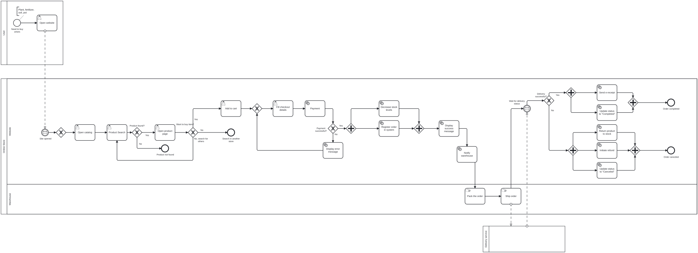
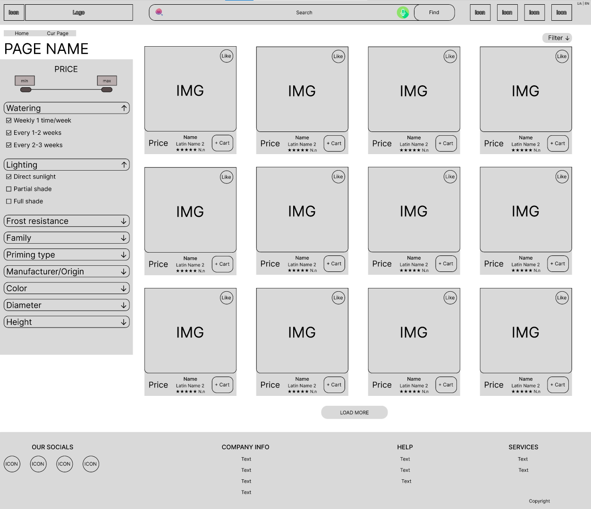
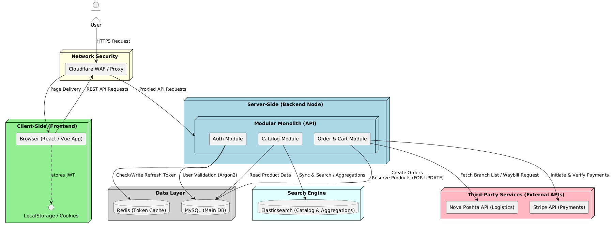
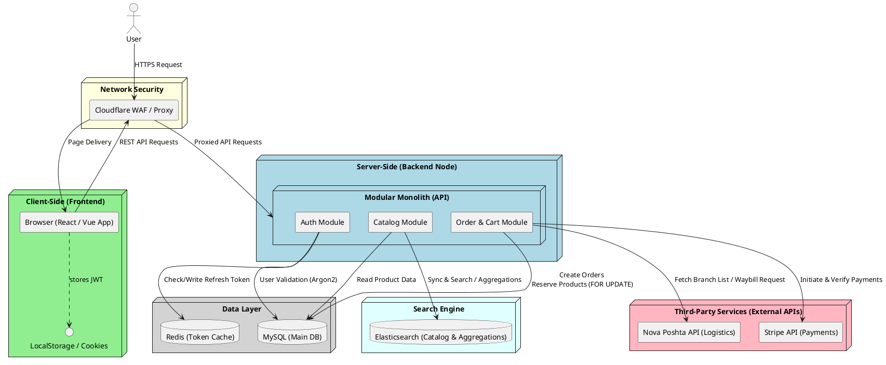
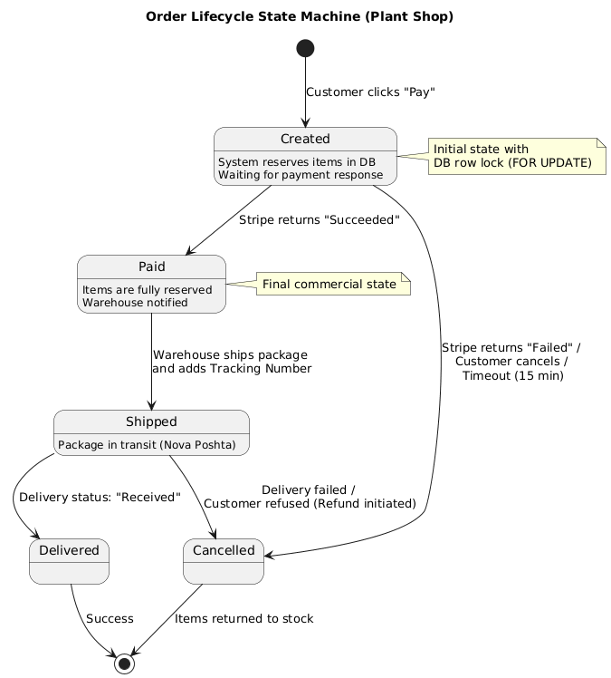
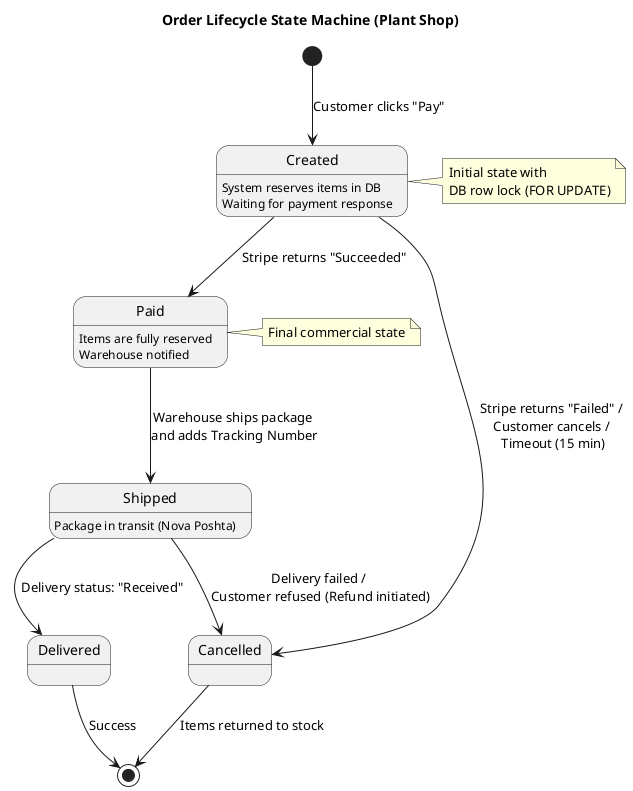
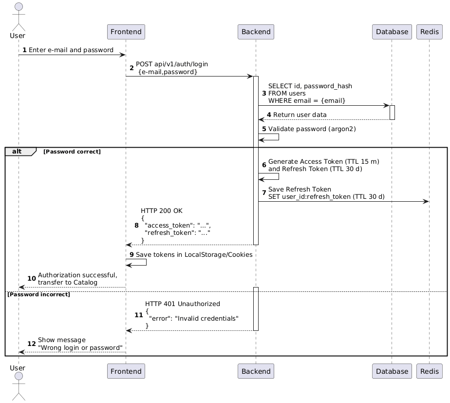
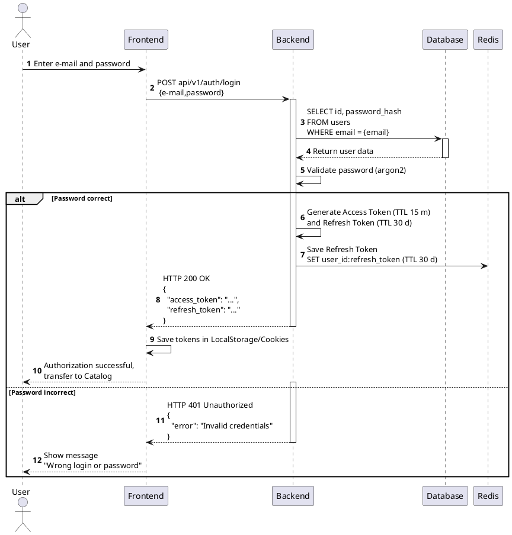
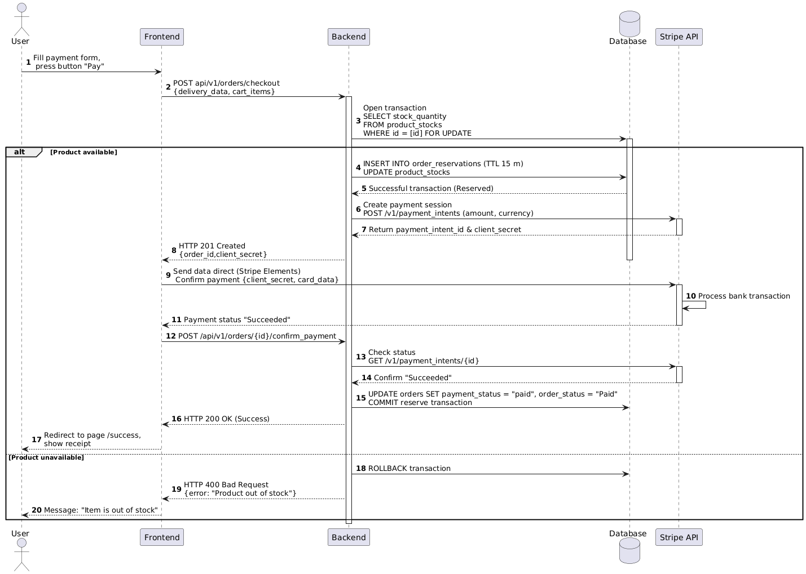
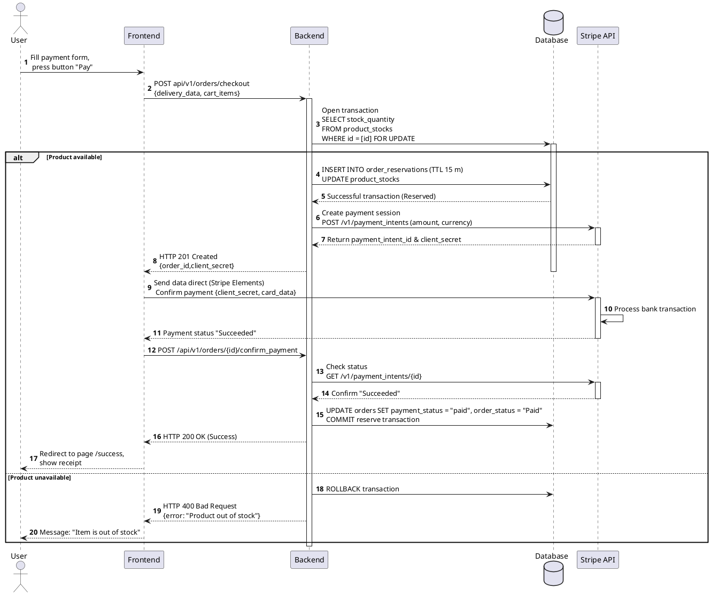

#  Green Shop: Повна технічна специфікація проєкту

##  Зміст
* [Блок 1: Бізнес-аналіз та стратегія (Business Analysis and Strategy)](#блок-1-бізнес-аналіз-та-стратегія-business-analysis-and-strategy)
  * [1. Бачення та межі продукту (Product Vision & Scope)](#1-бачення-та-межі-продукту-product-vision--scope)
  * [2. Цільова аудиторія та Персони (User Personas)](#2-цільова-аудиторія-та-персони-user-personas)
  * [3. User Stories](#3-user-stories)
  * [4. Бізнес-цілі та бізнес-вимоги проєкту (Business Goals & Requirements)](#4-бізнес-цілі-та-бізнес-вимоги-проєкту-business-goals--requirements)
  * [5. Обмеження та припущення проєкту (BPMN)](#5-обмеження-та-припущення-проєкту-assumptions--constraints)
* [Блок 2: Системний аналіз та дизайн (System Analysis and Design)](#блок-2-системний-аналіз-та-дизайн-system-analysis-and-design)
  * [1. Архітектурний роутинг та структура інтерфейсів (UI/UX Scope)](#1-архітектурний-роутинг-та-структура-інтерфейсів-uiux-scope)
  * [2. Модуль: Каталог та Фільтрація товарів (Functional Requirements & Use Cases)](#2-модуль-каталог-та-фільтрація-товарів-catalog--filtering)
  * [3. Сценарії використання (Use cases)](#3-сценарії-використання-use-cases)
  * [4. Нефункциональні вимоги (Non-Functional Requirements – NFR)](#4-нефункціональні-вимоги-non-functional-requirements--nfr)
  * [5. Модель даних (ERD) та Архітектура бази даних](#5-модель-даних-erd-та-архітектура-бази-даних)
  * [6. Технічні взаємодії](#6-технічні-взаємодії)
  * [7. Документація API та Mock Server (Postman)](#7-документація-api-та-mock-server-postman)

---

## Блок 1: Бізнес-аналіз та стратегія (Business Analysis and Strategy)

### 1. Бачення та межі продукту (Product Vision & Scope)

#### 1.1. Бізнес-контекст та проблема (Business Background)
Багато потенційних клієнтів відмовляються від купівлі домашніх рослин через **відсутність чіткої та прозорої інформації щодо догляду** за кожним конкретним видом. Користувачі бояться «загубити» рослину через неправильний полив чи рівень освітлення. 

Крім того, купівля рослини часто створює додатковий клопіт: необхідність окремо шукати підходящий ґрунт, горщик правильного розміру на виріст та відповідні добрива.

#### 1.2. Ціннісна пропозиція продукту (Value Proposition)
Платформа пропонує клієнту не просто окремий товар, а **комплексне екосистемне рішення**, яке економить час, гроші та зусилля покупця:
1. **Інтуїтивний підбір:** Можливість точного вибору рослини за критеріями (фільтрами) комфорту користувача, що нівелює страх зробити помилку.
2. **Конструктор комплекту (Cross-sell):** Клієнт може в один клік кастомізувати покупку, обравши замість стандартного транспортувального горщика постійний (з вибором кольору, матеріалу та розміру «на виріст»), а також автоматично підібрані під цей вид добрива.
3. **Послуга «Готове рішення»:** Додаткова послуга професійного пересаджування рослини перед відправкою. Це дозволяє покупцю отримати повністю готову до інтер'єру рослину без необхідності проводити брудні роботи вдома.

---

### 2. Цільова аудиторія та Персони (User Personas)

#### 2.1. Персона 1: Новачок Олексій (Beginner User)
* **Портрет:** Хоче додати зелені в оселю, але не має досвіду догляду за рослинами. Виснажений від суперечливої інформації в інтернеті та заплутаної класифікації (наприклад, коли звичайна монстера має безліч різних підвидів).
* **Контекст та болі:**
  * Боїться марно витратити гроші та час, якщо рослина загине.
  * Не розуміє графіків поливу (що потрібно поливати щодня, а що – раз на тиждень).
  * Не може самостійно оцінити мікроклімат у квартирі: вагається, куди поставити вазон – на сонячну кухню чи в темнішу кімнату з кондиціонером та жалюзі.
* **Як система вирішує біль (Product Solution):**
  * **Спеціалізовані фільтри:** Дозволяють Олексію обирати рослину за параметрами його житла (`Lighting`, `Watering`), після чого йому залишається зважати лише на ціну.
  * **Онлайн-консультація:** Можливість отримати професійну допомогу та персональну рекомендацію експерта прямо на платформі.
  * **Автоматичний підбір розхідників:** Супутні товари (горщик, ґрунт, добрива) та послуга пересаджування вже ідеально підібрані під обрану рослину, що виключає ризик зробити помилку при догляді.

#### 2.2. Персона 2: Досвідчена Олена (Expert Collector)
* **Портрет:** Займається домашнім садівництвом понад 5 років, колекціонує конкретний рід рослин (наприклад, монстери).
* **Контекст та болі:**
  * **Плутанина з назвами:** Через відсутність єдиних стандартів у магазинах, вона ризикує випадково придбати вид монстери, який у неї вже є.
  * **Проблеми з логістикою розхідників:** При замовленні на різних маркетплейсах горщики та правильний субстрат часто затримуються або приїжджають у різний час, що зриває графік пересаджування.
  * **Естетичний дискомфорт:** Бажає демонструвати свою колекцію іншим садівникам, але стандартні пластикові горщики псують інтер'єр кімнати.
* **Як sistema вирішує біль (Product Solution):**
  * **Глобальна стандартизація (Пошук за латиною):** Наявність ботанічних латинських назв на картках товарів та можливість пошуку за ними дозволяє Олені точно ідентифікувати рідкісні підвиди без ризику дублювання.
  * **Комплексна доставка (All-in-One):** Повністю усуває проблему затримок, адже рослина, кастомізований за кольором/матеріалом дизайнерський горщик та потрібний ґрунт приїжджають в одному замовленні.

---

### 3. User Stories

*  **US-01 (Каталог та Новачок):** Як покупець-новачок, я хочу мати фільтри за критеріями догляду (наприклад, освітлення, частота поливу), щоб впевнено обирати рослини під мої умови та не боятися, що вони загинуть.
*  **US-02 (Комплектація та Профі):** Як досвідчений користувач, я хочу мати можливість купувати продукти комплектом (рослину, добрива, грунт, сумісний горщик та послугу пересадки), отримуючи індивідуальне комплексне рішення в одному замовленні.
*  **US-03 (Авторизація):** Як зареєстрований користувач, я хочу, щоб система зберігала мій стан входу (сесію), щоб мені не доводилося повторно вводити логін та пароль при кожному новому візиті на сайт.

---

### 4. Бізнес-цілі та бізнес-вимоги проєкту (Business Goals & Requirements)

#### 4.1. Бізнес-цілі (Business Goals / KPIs)
* **BG-1 (Time-to-Market):** Запустити онлайн-продажі (MVP платформи) у термін **до 2 місяців** з моменту старту активної розробки для швидкого виходу на ринок та тестування бізнес-моделі.
* **BG-2 (AOV Growth):** Збільшити середній чек замовлення (*Average Order Value – AOV*) шляхом впровадження механізмів крос-продажів (*cross-sell*) супутніх товарів та додаткових послуг.

#### 4.2. Бізнес-вимоги (Business Requirements – BR)
*  **BR-01 (Online Payments):** Система повинна забезпечувати можливість проведення онлайн-оплат замовлень у реальному часі через інтеграцію із зовнішнім платіжним шлюзом (наприклад, LiqPay, Monobank API або Fondy).
*  **BR-02 (Smart Bundling Logic):** Реалізувати в системі бізнес-логіку комплексної збірки замовлення. Платформа має автоматично рекомендувати та дозволяти гнучко підбирати горщики, добрива та послуги пересаджування, які технічно сумісні та підходять під параметри конкретної обраної рослини.

---

### 5. Обмеження та припущення проєкту (Assumptions & Constraints)

#### 5.1. Географія та логістика (Scope & Logistics)
* **Перехід в онлайн:** Бізнес масштабується з локальної фізичної мережі одного міста до загальнонаціонального інтернет-магазину.
* **Доставка:** Продажі здійснюються по всій території країни. Логістика реалізується через інтеграцію із зовнішніми поштовими сервісами та службами доставки (наприклад, Нова Пошта).

#### 5.2. Межі асортименту (Product Boundaries)
* **MVP Специфікація:** На етапі першого запуску каталог містить виключно кімнатні (домашні) рослини, а також пов'язані з ними супутні товари (дизайнерські горщики, спеціалізовані добрива, субстрати) та послуги (професійна посадка/пересадка).
* **Out of Scope:** Садові культури, відкритий ґрунт, вуличні дерева, кущі та насіння для агросектору на етапі MVP не підтримуються.

#### 5.3. Локалізація та мови (Localization)
* **Мовні версії:** Система повинна підтримувати дві мовні локалізації – українську (UA) та англійську (EN).
* **Обґрунтування:** Попри фокус на внутрішній ринок країни, бізнес закладає англійську мову для обслуговування експатів, туристів та іноземців, які проживають у країні та не володіють державною мовою.
* **Номенклатура:** Незалежно від обраної мови інтерфейсу, у картці товару та пошуку обов'язково зберігається міжнародна ботанічна назва рослини латиною.

* #### 5.4. Архітектурні припущення (Architectural Assumptions)
* **Стратегія MVP:** Для забезпечення швидкого виходу на ринок, мінімізації часу розробки та зниження витрат на інфраструктуру, на етапі запуску MVP приймається рішення використовувати модульну монолітну архітектуру.
* **Перспектива масштабування:** Бекенд-додаток повинен бути строго розмежований на ізольовані логічні модулі (Каталог, Кошик, Користувачі). Це необхідно для того, щоб при майбутньому зростанні навантаження ці блоки можна було безболісно винести в окремі мікросервіси без повного переписування коду системи.

#### 5.5 Моделювання бізнес-процесів (BPMN-діаграма)
Дана діаграма описує життєвий цикл замовлення: від виникнення потреби у покупця до фінального отримання товару.

Нотація структурована за допомогою трьох незалежних пулів:
* **Пул User (Клієнт):** Відображає автономність клієнта. Відбувається ініціація подією «Потреба у покупці» та процесом «Відкриття вебсайту», що передає сигнал (*Message Flow*) до системи магазину.
* **Пул Online Store (Платформа магазину):** Розділений на дві доріжки (*Website* та *Warehouse*), що дозволяє чітко розмежувати цифрові операції (фронтенд/бекенд) та фізичні складські процеси.
* **Пул Delivery Service (Логістичний партнер):** Представлений як «Black Box», що підкреслює інтеграційний характер взаємодії із зовнішньою системою тільки через повідомлення.

---

## Блок 2: Системний аналіз та дизайн (System Analysis and Design)

### 1. Архітектурний роутинг та структура інтерфейсів (UI/UX Scope)

Система реалізує модульну монолітну структуру, де фронтенд взаємодіє з бекендом через єдиний домен. Додаток повинен містити такі обов'язкові користувацькі інтерфейси (сторінки/екрани) та відповідні їм URL-маршрути:

*  **Каталог товарів (`/catalog`):** Головна сторінка та початковий екран для покупця. Надає можливість перегляду та вибору рослин. Кореневий URL сайту за замовчуванням.
*  **Сторінка товару (`/products/{id}`):** Детальна картка конкретної рослини або супутнього товару, де `{id}` – унікальний ідентифікатор позиції в базі даних.
*  **Кошик (`/cart`):** Інтерфейс перегляду обраних товарів, керування їхньою кількістю та конфігурації залежних послуг/аксесуарів.
*  **Оформлення замовлення (`/checkout`):** Форма введення даних покупця, вибору методів доставки по країні та інтеграції з платіжним шлюзом.
*  **Реєстрація (`/register`) та Аутентифікація (`/login`):** Екрани створення акаунта та входу в систему.

#### 1.1 Прототип сторінки «Каталог» (Figma UI/UX) **[Інтерактивний прототип](https://www.figma.com/design/M6TdfaBpb7u0eTTQ6W4zFF/PlantStore?node-id=01&t=00kjkQDIeDVouZMJ-1)**
На інтерфейсі сторінки «Каталог» спроєктовано елементи з урахуванням потреб обох типів цільової аудиторії (новачків та досвідчених рослинників):

* **Хедер (Header):**
  * *Брендинг:* Логотип та назва магазину.
  * *Пошукова стрічка:* Реалізовано для швидкого доступу до товарів за назвою.
  * *Функціональні іконки:* Замовлення консультації (швидкий зв’язок із фахівцем), Профіль (доступ до особистого кабінету) та Кошик (візуальний індикатор доданих товарів).
  * *Локалізація:* Перемикач мов (UA/EN) для підтримки вимог щодо доступності системи для іноземних користувачів.
* **Головна частина (Main Content):**
  * *Навігація:* Чіткий заголовок сторінки та «хлібні крихти» (*Breadcrumbs*), що забезпечують розуміння поточної позиції користувача.
  * *Панель фільтрації:* Реалізовано систему детальних фільтрів за параметрами догляду (*освітлення, полив, складність*). Це дозволяє отримати експертну вибірку товарів.
  * *Сітка товарів:* Товари представлені у вигляді карток. Реалізовано сортування за ціною та алфавітом.
  * *Пагінація (Load More):* Використання кнопки 'Load More' замість класичної пагінації забезпечує безперервність користувацького досвіду та плавний перегляд асортименту.
* **Футер (Footer):**
  * Стандартний блок із посиланнями на соціальні мережі, розділи допомоги, політику конфіденційності та копірайт.
    
### 2. Модуль: Каталог та Фільтрація товарів (Catalog & Filtering)

#### 2.1 Функціональні вимоги (Functional Requirements)

##### ФР-01: Відображення товарів, яких тимчасово немає на складі
* **Опис:** Якщо за обраною комбінацією фільтрів існують товари, але їхня кількість на складі дорівнює нулю, система повинна відобразити ці картки у загальній сітці та візуально промаркувати їх.
* **Критерії приймання:**
  * **Given:** Користувач обрав фільтри (також враховуємо кейс, де обрана кількість фільтрів = 0).
  * **When:** Даних товарів немає в наявності на складі (`stock_quantity = 0`).
  * **Then:** Система має відобразити картки з текстовою позначкою “Немає в наявності” поверх зображення.
  * **And:** Кнопка `+ Cart` стає неактивною (`disabled`), а її текст змінюється на «Повідомити про наявність».

##### ФР-02: Обробка порожнього результату фільтрації
* **Опис:** Якщо обрана користувачем комбінація фільтрів не видає жодного результату в базі даних (кількість товарів = 0), система повинна приховати сітку товарів і вивести інформаційне повідомлення з аналітичною підказкою.
* **Критерії приймання:**
  * Кількість відображених системою товарних карточок становить 0.
  * Посередині каталогу (замість сітки товарів та кнопки `LOAD MORE`) виведено повідомлення “Такого товару немає”.
  * Під повідомленням “Такого товару немає” виводиться аналітична підказка про кількість доступних товарів за кожним обраним фільтром окремо. Формат відображення: *[Назва фільтра] – [Кількість товарів у базі]* (наприклад: *Пальми – 12 шт., Фіолетові – 2 шт., Великі – 46 шт.*).

##### ФР-03: Логіка динамічного підвантаження (Infinite Scroll & Load More)
* **Опис:** Система повинна автоматично завантажувати товари при прокрутці сторінки до ліміту в 24 одиниці, після чого вимагати підтвердження дії через кнопку для подальшої видачі.
* **Критерії приймання:**
  *  **Початковий стан:** При першому завантаженні каталог відображає 8 карток товарів.
  *  **Механіка Virtual Scroll:** При прокрутці (скролі) вниз нові картки додаються в кінець списку. Картки, що повністю ховаються за хедером сторінки, повинні видалятися з пам'яті (*Virtual Scroll*) для оптимізації продуктивності браузера.
  *  **Ліміт автоматизації:** Автоматичне підвантаження працює до досягнення ліміту у 24 відображені картки.
  *  **Кнопка Load More:** Після завантаження 24-ї картки система відображає кнопку "Load More" під сіткою товарів. Подальше завантаження (25+ товар) без натискання кнопки заборонено.
  *  **API запит:** Натискання "Load More" ініціює запит `GET v1/products?limit=24&offset=n`, де `limit` – розмір порції даних (24), а `offset` (n) – зміщення в БД, яке збільшується на 24 при кожному наступному запиті.
  *  **Кінцевий стан:** Якщо запит повертає порожній список (всі товари переглянуто):
     * Кнопка "Load More" переходить у стан `Disabled` (сірий колір, неактивна для кліку).
     * Під кнопкою з'являється інформаційна підказка: "Всі товари переглянуто".

### 3. Сценарії використання (Use cases)

#### Use case (Cart)
* **Name:** Додавання комплекту товарів та послуг до кошика.
* **Actors:** Користувач (зареєстрований або гість), Система магазину.
* **Preconditions:** Користувач знаходиться на сторінці товару (рослини).
* **Main course (Основний сценарій):**
  * Користувач обирає додаткові товари (добрива та горщик) із каруселі аксесуарів на сторінці рослини.
  * Користувач активує прапорець (чекбокс) біля послуги «Пересаджування».
  * Система динамічно перераховує загальну вартість комплекту біля кнопки “Додати в кошик” (Сума: рослина + кастомний горщик + добрива + послуга пересадки).
  * Користувач натискає кнопку “Додати в кошик”.
  * Система відправляє асинхронний запит на бекенд, де перевіряє поточну наявність усіх обраних позицій на складі (`stock_quantity > 0`). Товари успішно додаються до кошика користувача в базі даних (або в LocalStorage для гостя) без встановлення броні (резерву) на складі.
  * Система збільшує лічильник товарів на іконці кошика в Header на +n (де n – кількість доданих позицій, у цьому випадку +4).
  * При взаємодії з іконкою “Кошик” (клік), система відображає випадаюче меню, де товари виводяться деревоподібним списком: Рослина є головним (батьківським) пунктом, а горщик, добрива та послуга пересадки – підпорядкованими (другорядними) пунктами.
* **Alternative course 1 (Race Condition на складі):**
  * Якщо в момент натискання кнопки “Додати в кошик” з'ясовується, що головного товару (рослини) або критичного аксесуара вже немає на складі (`stock_quantity = 0` через паралельну покупку іншим користувачем):
  * Система блокує додавання комплекту до кошика.
  * Кнопка “Додати в кошик” для цього товару переходить у стан Disabled та змінюється на “Повідомити про наявність”.
  * Користувачу виводиться інформаційне сповіщення: "Вибачте, цей товар щойно закінчився".
* **Alternative course 2 (Пересадка без кастомного горщика):**
  * Якщо користувач активував чекбокс послуги “Пересаджування”, але залишив у наборі стандартний транспортувальний горщик:
  * Система блокує активацію кнопки “Додати в кошик”.
  * Поруч із послугою пересадки виводиться попередження червоним кольором: "Будь ласка, оберіть кастомний горщик для пересадки".

#### Use case (sessions)
* **Name:** Продовження роботи користувача з магазином.
* **Actors:** Користувач, Система.
* **Preconditions:** Користувач пройшов автентифікацію через дані сайту (JWT) чи сторонній сервіс (OAuth 2), тобто отримані `access token` (з TTL 15 хвилин) та `refresh token` (з TTL 30 днів).
* **Main course:**
  * Користувач відкриває сторінку сайту через певний проміжок часу (наприклад, через добу).
  * Відбувається запит HTTP за ендпоїнтом `POST /api/auth/refresh` на Сервіс авторизації (Auth Service).
  * Сервіс авторизації звертається до бази даних Redis, де відбувається перевірка TTL (Time to Live) refresh токена, а саме умови: `exp >= current_time`, де `exp` – Expire time токена, а `current_time` – поточний час сервера. Якщо умова вірна – Сервіс авторизації виконує перевипуск нової пари Access + Refresh токенів, а старий refresh токен видаляється з Redis.
  * Користувач отримує нову пару токенів у браузері (непомітно для себе) та продовжує роботу із системою магазину без повторного введення логіна та пароля.
* **Alternative path:**
  * Якщо умова `exp >= current_time` не виконана, тобто `exp < current_time` (час дії refresh токена вичерпано):
  * Сервіс авторизації відхиляє запит.
  * Користувача автоматично перенаправляє (редиректить) на форму входу в систему – сторінку Аутентифікації (`/login`).

#### Use case (Checkout)
* **Name:** Оформлення доставки замовлення.
* **Actors:** Користувач, Система магазину.
* **Preconditions:** Користувач натиснув кнопку “Оформити замовлення” в кошику, система перевірила наявність товару на складі (`stock_quantity > 0`) і відкрила екран чекауту.
* **Main course (Основний сценарій – Доставка у відділення):**
  * Система автоматично підставляє в поля введення дані з профілю користувача (users), залишаючи їх доступними для редагування.
  * Користувач обирає службу доставки "Нова Пошта" у випадаючому меню.
  * Користувач обирає тип доставки: "Відділення".
  * Фронтенд робить запит `GET /api/v1/nova_post/warehouses?city={user_city}` до нашого сервера. Система витягує список відділень із локальної бази даних та відображає їх у дропдауні.
  * Користувач обирає бажане відділення зі списку.
  * Користувач обирає спосіб оплати та натискає кнопку “Підтвердити замовлення”.
* **Alternative path:**
  * Цей крок починається після третього кроку основного сценарію, якщо користувач обрав "Кур'єр":
  * Система приховує дропдаун із вибором відділень.
  * Система відображає додаткові обов'язкові поля для введення адреси: "Вулиця", "Будинок", "Квартира". Користувач заповнює поля адреси вручну.
  * Користувач переходить до останнього кроку основного сценарію (вибір оплати та підтвердження).

### 4. Нефункціональні вимоги (Non-Functional Requirements – NFR)

#### 4.1. Швидкодія та Продуктивність (Performance)

##### NFR-01 (Initial Load – Cold Start): Повне завантаження сторінки та відображення (момент можливості взаємодії) першої порції товарів (8 карток) при першому візиті не повинно перевищувати 2.0 секунди.
* **Критерії приймання:**
  * Користувач запустив сторінку уперше (кеш браузера порожній).
  * Відбувається відкриття сторінки каталогу.
  * Сторінка та початкові 8 товарів повинні повністю завантажитись (момент можливості взаємодії), не більше ніж за 2 секунди.

##### NFR-02 (Initial Load – Warm Start): Повне завантаження та відображення (момент можливості взаємодії) при повторному візиті (з кешем) – не більше 1.5 секунди.
* **Критерії приймання:**
  * Користувач запустив сторінку не вперше (присутній завантажений кеш).
  * Відбувається відкриття сторінки каталогу.
  * Сторінка та початкові 8 товарів повинні повністю завантажитись (момент можливості взаємодії), не більше ніж за 1.5 секунди.

##### NFR-03 (Data Retrieval Latency): Час очікування відповіді від сервера після натискання кнопки Load More (запит на 24 нові картки) та відображення (момент можливості взаємодії) нових 8 карток не повинні перевищувати 1.5 секунди (норматив – 1.2 секунди).
* **Критерії приймання:**
  * Користувач натиснув кнопку `Load More` та відправив запит на завантаження додаткових 24 карток.
  * Коли дійшов до кінця завантажених товарів.
  * Нові картки було отримано та відображено (момент можливості взаємодії) не більше ніж за 1.5 секунди.

##### NFR-04 (Smooth Scrolling & Rendering): При прокрутці карток після отримання даних від сервера за методом GET, відображення (момент можливості взаємодії) кожної наступної порції карток (рендеринг у DOM) має відбуватися миттєво – не більше 0.1 секунди.
* **Критерії приймання:**
  * Користувач завантажив нову порцію з 24 карток після натискання кнопки `Load More` та скролить.
  * Коли він проходить n пікселів.
  * Відображення (момент можливості взаємодії) нових карток відбувається миттєво – не більше 0.1 секунди.

##### NFR-05 (Concurrent Users / Sessions): Система витримує навантаження до 1000 одночасних активних користувачів (сесій) без деградації часу відповіді системи.
* **Критерії приймання:**
  * За допомогою інструментів тестування (JMeter або k6) створити 1000 унікальних віртуальних користувачів, які паралельно здійснюють перегляди каталогу та додавання товарів до кошика.
  * Протягом усього тесту середній час відповіді сторінок для користувачів не повинен перевищувати 1.0 секунду (1000 мс).

##### NFR-06 (Throughput / RPS): Система розрахована на стабільну обробку навантаження у 150 запитів за секунду (RPS) в нормі та короткочасні піки до 300 RPS.
* **Критерії приймання:**
  * Подати штучне навантаження (Stress Testing) з поступовим підняттям планки до 300 запитів за секунду.
  * При піковому навантаженні у 300 RPS кількість помилок сервера (HTTP статусів 5xx) не перевищує 1% від усіх запитів.
  * Час відповіді сервера (Response Time) на запити пагінації каталогу при 300 RPS залишається в межах норми – не більше 1.0 секунди (1000 мс).

#### 4.2. Безпека та Захист даних (Security)

##### NFR-07 (Password Hashing): Паролі користувачів мають зберігатися у хешованому вигляді (за алгоритмом Argon2) в базі даних.
* **Критерії приймання:**
  * Користувач зареєструвався та створив пароль.
  * Коли користувач натиснув кнопку "Створити акаунт".
  * Пароль був хешований за алгоритмом Argon2 та збережений у базі даних (відкритий текст пароля ніде не логується і не зберігається).

##### NFR-08 (Transport Security): Передача всього мережевого трафіку між клієнтом та сервером повинна відбуватися виключно за захищеним протоколом HTTPS.
* **Критерії приймання:**
  * Користувач клікнув на посилання магазину або ввів URL вручну.
  * Коли відбувається підключення до сервера.
  * З’єднання відбувається за протоколом HTTPS (при спробі HTTP відбувається автоматичний редірект 301 на HTTPS).

##### NFR-09 (DDoS Protection): Захист від DDoS-атак (на рівнях мережі L3, L4 та додатків L7) повинен бути реалізований за допомогою підключення хмарного сервісу Cloudflare.
* **Критерії приймання:**
  * Сервіс Cloudflare налаштований на режим Proxy (у панелі Cloudflare показується статус "Proxied" для головних доменів та піддоменів).
  * Реальна ІР-адреса хостингу/сервера прихована від зовнішнього сканування.
  * При атаці потужністю до 10 000 RPS відбувається автоматична фільтрація зловмисного трафіку із забезпеченням доступності для реальних користувачів не нижче 99.9%.

##### NFR-10 (Rate Limiting): Обмеження системи на максимальну кількість запитів від однієї ІР-адреси виконано через Cloudflare WAF Rate Limiting. Для публічних сторінок (каталог) ліміт становить 60 запитів/хв, для критичних (авторизація, кошик) – не більше 5 запитів/хв.
* **Критерії приймання:**
  * Користувач здійснює 6-й запит за хвилину до критичної сторінки (наприклад, оновлення форми входу).
  * Cloudflare блокує запит, повертає HTTP-статус 429 Too Many Requests (що фіксується при тестуванні через Postman) та відображає сторінку з повідомленням "Забагато спроб. Спробуйте пізніше".

##### NFR-11 (WAF Application Security): Захист від SQL-injection та XSS-атак реалізовано за допомогою Cloudflare WAF Managed Rules.
* **Критерії приймання:**
  * У хмарному сервісі Cloudflare активовано набір базових правил безпеки OWASP Core Rule Set.
  * При спробі введення шкідливого скрипту або SQL-запиту у рядок браузера чи поля вводу (наприклад, `plantshop.com?UNION SELECT NULL`), запит блокується.
  * На екрані користувача відображається стандартна сторінка блокування Cloudflare з повідомленням "Denied/Blocked".

#### 4.3 Доступність

##### NFR-12 (System Availability / Uptime): Коефіцієнт доступності сайту (Uptime) повинен становити не менше 99.5% на місяць (максимально дозволений сумарний простій – не більше 3 годин 39 хвилин на місяць).
* **Критерії приймання:**
  * Здійснюється автоматична відправка HTTP-запитів кожні 5 хвилин за допомогою зовнішнього сервісу моніторингу (наприклад, UptimeRobot) на критичні ендпоінти: Логін (`/login`), Каталог товарів (`/catalog`), Оформлення замовлення (`/checkout`).
  * Час простою розраховується від моменту останнього успішного запиту (HTTP 200) до першого успішного запиту після відновлення системи.
  * Сумарний час усіх збоїв за календарний місяць порівнюється з максимально допустимим нормативом (3 години 39 хвилин).

### 5. Модель даних (ERD) та Архітектура бази даних

Архітектура бази даних (MySQL) спроєктована за модульним принципом і розділена на три ключові логічні зони для забезпечення високої продуктивності та масштабованості системи.

#### 5.1. Зона користувачів (Identity & Access)
* **users:** Зберігання персональних даних, облікових записів та хешів паролів користувачів.
* **addresses:** Гнучка система збереження адресних профілів (адресна книга), що підтримує як доставку у відділення поштових операторів, так і кур'єрську доставку.

#### 5.2. Зона продуктів (Product Management & Catalog)
* **products:** Центральна (батьківська) таблиця, що містить загальні комерційні атрибути (назва, ціна, тип, складські залишки).
* **Специфікації (Subtypes):** Реалізовано через патерн наслідування таблиць для окремих категорій (Рослини, Горщики, Добрива, Субстрати). Це дозволяє зберігати унікальні характеристики для кожного типу товарів без надлишковості даних.
* **Довідники (Filters):** Система допоміжних таблиць для параметрів догляду (освітлення, полив, родина), що забезпечує швидку фільтрацію та цілісність даних у каталозі.

#### 5.3. Робочі та транзакційні таблиці (E-commerce Engine)
* **Cart & Order Management:** Таблиці кошика та замовлень, що фіксують стан покупки та історію транзакцій.
* **Logistics:** Окремий блок для управління методами та службами доставки (Нова Пошта, Укрпошта).
* **product_assemble:** Таблиця асоціацій «багато-до-багатьох» (*Many-to-Many*), що реалізує бізнес-логіку конструктора: автоматичний підбір сумісних додаткових товарів (горщиків, ґрунтів) до конкретної обраної рослини.

---

### 6. Технічні взаємодії

#### 6.1. Діаграма розгортання (Deployment Diagram)

Переглянути PlantUML код цієї діаграми

Діаграма відображає фізичне розміщення компонентів системи, використання Cloudflare для мережевого захисту та розподіл даних між реляційною БД (MySQL), кеш-шаром (Redis) та пошуковим рушієм (Elasticsearch), а також сторонніми сервісами доставки та оплати (Nova Poshta API) та (Stripe API), відповідно.

#### 6.2. Життєвий цикл замовлення (Order Lifecycle State Machine)

Переглянути  PlantUML код цієї діаграми

Схема фіксує переходи статусів замовлення від створення до фінальної доставки або скасування, враховуючи логіку автоматичного повернення товару на склад у разі невдалої логістики.

#### 6.3. Діаграма послідовності «Процес автентифікації користувача» (Auth Sequence Flow)

Переглянути PlantUML код цієї діаграми

* **Ключова логіка:** При успішному вході система генерує пару токенів (Access/Refresh). Паролі перевіряються за допомогою криптографічного алгоритму Argon2 на бекенді.
* **Роль Redis:** Refresh-токен записується в оперативну пам'ять Redis з TTL 30 днів. Це забезпечує надшвидку перевірку та оновлення сесій без постійного навантаження на основну базу даних MySQL.
* **Безпека:** У разі помилки (HTTP 401) система повертає уніфіковану відповідь, приховуючи від зловмиснака, що саме було введено невірно (логін чи пароль).

#### 6.4. Діаграма послідовності «Оформлення замовлення та оплата» (Stripe & Checkout Flow)

Переглянути PlantUML код цієї діаграми

* **Контроль залишків (Race Condition):** Бекенд відкриває транзакцію в MySQL та блокує рядок товару за допомогою команди `FOR UPDATE`. Це гарантує, що якщо товар закінчився в ту саму мілісекунду, система зробить `ROLLBACK` і не допустить подвійного продажу.
* **Інтеграція зі Stripe:** Сервер створює платіжну сесію та повертає `client_secret`. Фронтенд передає дані картки через Stripe Elements напряму на сервери Stripe. Це гарантує безпеку, оскільки наш бекенд взагалі не бачить і не зберігає дані банківських карт користувачів.

### 7. Документація API та Mock Server (Postman)

Створено колекцію **Plant Shop API**, яка повністю описує REST API для інтернет-магазину кімнатних рослин та аксесуарів. Проєкт спроєктовано з урахуванням сучасних стандартів безпеки, обробки помилок та інтеграції з популярними сторонніми сервісами (Stripe, логістичні оператори).

Колекція налаштована для роботи з **Postman Mock Server**, що дозволяє симулювати реальну поведінку бекенду для позитивних та негативних сценаріїв (позитивні відповіді `200/201`, помилки `401/409`).

#### 7.1 Архітектурні особливості та логіка API

##### 1. Безпека та Аутентифікація
* Процес входу в систему (`POST /auth/login`) реалізовано за класичною схемою JWT (JSON Web Tokens).
* При успішній авторизації сервер повертає пару токенів: `Access Token` (короткотривалий, для захисту запитів) та `Refresh Token` (довготривалий, для оновлення сесії).
* **Правило безпеки:** У разі помилки (`401 Unauthorized`) система повертає уніфіковану відповідь `Wrong login or password`, приховуючи від зловмисника, яка саме частина даних була введена невірно. Паролі ніколи не повертаються у тілі відповіді.

##### 2. Оформлення замовлення (Checkout & Склад)
* **Інтеграція доставки:** Запит `POST /checkout` приймає унікальні ідентифікатори `city_ref` та `warehouse_ref` для подальшої синхронізації з API служб доставки (наприклад, Нова Пошта).
* **Інтеграція платежів (Stripe):** При успішному оформленні замовлення бекенд повертає об'єкт `payment_integration` із ключем `client_secret`. Це дозволяє фронтенду ініціалізувати платіжну форму Stripe безпосередньо в інтерфейсі.
* **Контроль залишків (Бізнес-конфлікти):** Якщо під час оплати товар закінчується на складі, API повертає статус `409 Conflict`. У відповіді передається масив `conflicting_items` із конкретними `product_id`, що дозволяє фронтенду гнучко підсвітити проблемні товари в кошику користувача.

##### 3. Формат даних (Enveloping)
* Для кращої масштабованості та гнучкості системи всі сутності у відповідях загорнуті в батьківські об'єкти (наприклад, `"user": { ... }` або `"order": { ... }`). Це дозволяє розширювати API без порушення зворотної сумісності з фронтендом.

#### 7.2 Основні сценарії користувача (User Flows)
* **Каталог товарів:** Перегляд доступного асортименту (`GET /catalog`).
* **Реєстрація та вхід:** Створення профілю (`POST /signup`) -> Аутентифікація (`POST /auth/login`).
* **Провал автентифікації:** Симуляція автентифікації з некоректними даними (`POST /auth/login` з помилкою `401 Unauthorized`).
* **Покупка (Успішна):** Додавання товарів у кошик та оплата (`POST /checkout` з поверненням токена Stripe).
* **Покупка (Збій складу):** Симуляція ситуації, коли товар закінчився (`POST /checkout` з помилкою `409 Conflict`).
* **Історія замовлень:** Перегляд списку та статусів своїх покупок у кабінеті (`GET /orders`).

#### 7.3 Налаштування для тестування
* Переконайтеся, що у вашій колекції (*Collection*) встановлено змінну `{{baseUrl}}`, яка вказує на URL вашого Mock-сервера.
* Для запитів, які симулюють помилки, передавайте відповідні тестові дані у тілі запиту (наприклад, неправильний пароль у Fail Auth).
* Переконайтеся, що заголовки `Content-Type: application/json` встановлені для всіх POST-запитів.
